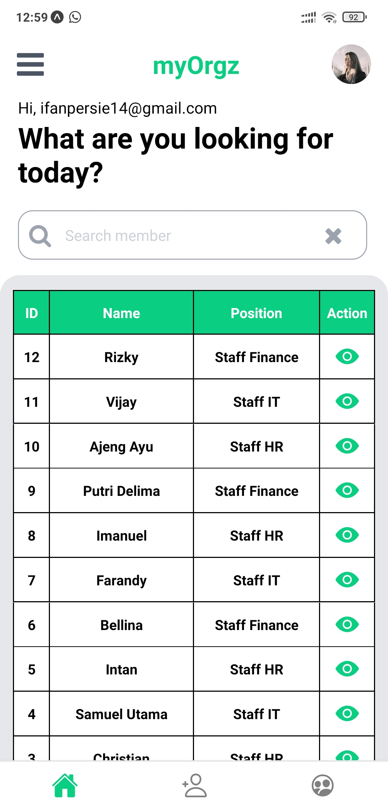

# pt-buana-varia-komputama - myorgz app

> **Berikut adalah beberapa Screenshots dan sedikit penjelasan dari myorgz app**

> **INFORMASI: Codingan Lengkap ada di Branch depelopment**

Pada myorgz app, ada 5 screen yaitu:

`Sign In` dimana user login melalui screen ini, jika user tidak ada akan ada notif email/password is wrong. 

`Sign Up` dimana user bisa register user baru dengan email dan password, dan juga user bisa sign up dengan akun Google-nya.

`Home Screen` dimana ditampilkan members. Dan bisa melihat detail members dengan klik symbol `mata`.
Untuk Logout bisa klik burger menu yang ada di `Home Screen`.

`Create New Member` dimana user dapat menambahkan member baru.

`Organizational Chart` dimana user bisa melihat Struktur Organisasi Perusahaan. Dan jika ada member baru langsung update secara otomatis di screen ini.

## 01 Sign In Screen

## 02 Sign In Screen, jika user tidak ada / tidak terdaftar

## 03 Sign Up Screen

## 04 Sign Up Screen

## 05 Success Register New User

## 06 Sign Up dengan Google (klik tombol Google) 

## 07 Home Screen dengan daftar member

## 08 Home Screen - Detail Member

## 09 Success - Create New Member

## 10 Create New Member Screen - filled

## 11 Organizational Chart Screen

## 12 Home Screen - Updated - New Member

## 13 Detail New Member

## 14 Logout App - Burgen Menu

## Terima Kasih :)